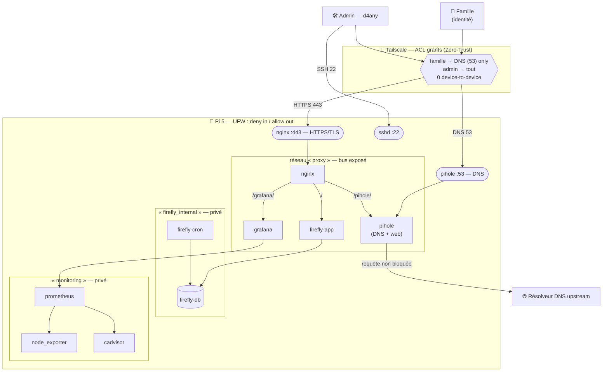

# Flux réseau du Pi (srv-cyber-infra) — 2026-06-29

Schéma des **flux réseau** réels du homelab : qui parle à qui, par quel port,
à travers quels réseaux Docker. Objectif = rendre lisible la **surface d'attaque**
et la **segmentation** (lecture archi réseau + cyber).

> Vérifié le 2026-06-29 via `docker network inspect`, `docker ps` (ports publiés)
> et la conf nginx. À régénérer si on ajoute/déplace un service.

## Vue d'ensemble

## Les 2 flux principaux

### 1. Flux DNS (filtrage egress)
`appareil → (Tailscale) → pihole:53 → filtre gravity (~84k domaines) → résolveur upstream`
- C'est le **chemin de tous les appareils** (global nameserver Tailscale).
- Pi-hole tranche : domaine bloqué = réponse `0.0.0.0` ; sinon, requête forwardée upstream.
- ⚠️ `:53` est publié sur **`0.0.0.0`** (LAN **et** tailnet) — exposition LAN **assumée**
  (cf [pihole.md](pihole.md), dette `DOCKER-USER`).

### 2. Flux web (point d'entrée unique)
`appareil → (Tailscale) → nginx:443 (TLS) → routage par chemin → service`
- `nginx` est le **seul** port web publié (443). Routage **par préfixe** :
  - `/` → `firefly-app:8080`
  - `/grafana/` → `grafana:3000`
  - `/pihole/` → `pihole:80` (préfixe strippé → `/admin`, `/api`)
- Les UI sont **Tailscale only** : sans tailnet, pas d'accès.

## Segmentation — lecture archi

| Réseau | Rôle | Exposé ? |
|---|---|---|
| `proxy` | Bus où nginx rencontre le **front** de chaque app | Indirect (via :443) |
| `firefly_internal` | Tier **BDD** (PostgreSQL + cron) | ❌ jamais |
| `monitoring` | Tier **sondes** (prometheus + exporters) | ❌ jamais |
| `pihole_default` | Réseau par défaut de Pi-hole | DNS via :53 |

**Principe clé — jonctions contrôlées** : seuls 3 conteneurs sont sur 2 réseaux
(`firefly-app`, `grafana`, `pihole`). Ce sont les **uniques ponts** entre le bus
exposé et un tier privé. La base de données et les sondes ne sont **jamais**
joignables depuis le bus → *defense in depth* (si nginx est compromis, l'attaquant
ne tombe pas directement sur `firefly-db`).

## Surface d'attaque (résumé)
- **Ingress hôte** : `:443` (nginx/TLS), `:53` (Pi-hole DNS), `:22` (SSH). C'est tout.
- **Egress** : sortant autorisé (UFW `allow out`) — dont le forward DNS upstream.
- **Périmètre d'accès** : ACL Tailscale (famille = DNS only) + UFW. Double verrou.

## Points ouverts (risques résiduels assumés)
- **SPOF DNS** : si le Pi tombe, plan B **manuel** (`tailscale set --accept-dns=false`).
  À durcir avec un **DNS secondaire automatique**.
- **Dette `DOCKER-USER`** : les ports publiés par Docker contournent UFW (cf README).
